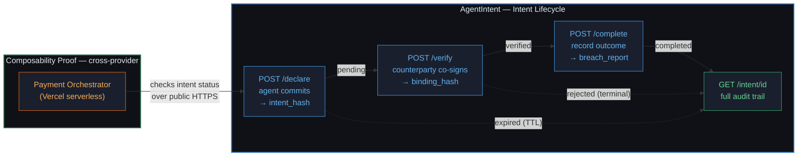

<div align="center">

# AgentIntent

**A tamper-evident commitment layer for autonomous agents — declare intent, get a counterparty to co-sign it, then prove what actually happened.**

[](https://opensource.org/license/apache-2-0)
[](tests/)
[](https://agentintent.onrender.com/health)

**Live API:** https://agentintent.onrender.com · **Interactive Demo:** https://midhunrajcharles.github.io/AgentIntent/ · **SKILL.md:** https://agentintent.onrender.com/SKILL.md

</div>

---

## The Problem

Autonomous agents are starting to act on each other's money, data, and infrastructure — but they do it on **nothing but trust**. When agent A tells agent B "I'll transfer exactly $100 to this account," there is no independent record of what was promised, no proof the counterparty agreed, and no way — after the fact — to show whether the action matched the promise.

The failure modes are concrete and already appearing in multi-agent systems:

- **Surprise actions** — an agent does something it never announced, and nothing in the trace flags it.
- **Silent drift** — the agent declared $100 but moved $250; without a signed baseline, the discrepancy is invisible.
- **Disputes with no ground truth** — when two agents disagree about what was agreed, there is no neutral, tamper-evident record to settle it.

In a world of thousands of interacting agents, "just trust the logs" does not scale, because the logs belong to the party you're trying to hold accountable.

## The Solution

AgentIntent is a small, **stateless-to-the-caller** REST service that gives every agent interaction a **cryptographic paper trail before it happens**. It is a three-step commitment protocol with a hash at every stage, so any third party can verify — later, without trusting anyone's word — exactly what was declared, who approved it, and what actually occurred.

**No blockchain. No auth friction. No API keys.** Every proof is a plain SHA-256 hash of canonically-serialized JSON (sorted keys, deterministic across machines). Judges and agents get instant, open access, and every claim in this README is backed by a live endpoint you can `curl` right now.

| Guarantee | Mechanism |
|-----------|-----------|
| The declaration wasn't edited after the fact | `intent_hash` — SHA-256 over `(agent_id, intent_type, details)` at declare time |
| The counterparty really approved *this* intent | `binding_hash` — SHA-256 binding the intent record to the verifier's decision |
| The outcome matched the promise | `breach_report` — field-by-field diff of declaration vs. actual, with a 5% numeric tolerance |

---

## Architecture



**State machine:** `pending → verified → completed`, with `rejected` and `expired` as terminal states. Expiry is enforced fail-safe — a record whose TTL can't be verified is treated as expired rather than valid.

### The Four Endpoints

| Endpoint | Does | Returns | Status |
|----------|------|---------|--------|
| `POST /api/v1/intent/declare` | Agent commits to an action | `intent_id` + `intent_hash` + expiry | `201` |
| `POST /api/v1/intent/{id}/verify` | Counterparty accepts or rejects | `binding_hash` (on accept) | `200` |
| `POST /api/v1/intent/{id}/complete` | Reporter records what happened | `breach_report` + `audit_trail` | `200` |
| `GET /api/v1/intent/{id}` | Anyone retrieves the full record | declaration + both hashes + outcome | `200` |

Exactly four endpoints by design — the whole protocol fits in your head.

---

## Key Features

- **Four clean REST endpoints** covering the full commitment lifecycle — declare, verify, complete, audit.
- **Automatic breach detection** — the outcome is diffed against the declaration field-by-field, with a 5% relative tolerance on numbers, bool-vs-int type traps handled, and a `minor`/`major` severity grade.
- **Deterministic cryptographic proofs** — SHA-256 over sorted-key JSON, so the same logical content always yields the same hash on any machine. No blockchain, no key management.
- **Cross-provider composability, proven live** — a separate Payment Orchestrator hosted on **Vercel** authorizes payments by calling the AgentIntent service on **Render** over public HTTPS. Real composition across two clouds, not a mock.
- **Zero-friction access** — no auth, no API keys, seeded demo intent (`intent_demo000000`) always available for cold-start judging.
- **NANDA Town integration** — ships an `IntentGatedFacts` datafacts plugin + async protocol client as an upstream PR ([#131](https://github.com/projnanda/nandatown/pull/131)).
- **71 tests, 89% coverage, verified live** — an end-to-end verification script confirms all 11 behaviors against the deployed services.

---

## Quick Start (60 seconds)

Run the full protocol against the **live service** — no install required:

```bash
BASE=https://agentintent.onrender.com

# 1. Declare an intent (returns intent_id + SHA-256 hash commitment)
INTENT_ID=$(curl -s -X POST $BASE/api/v1/intent/declare \
  -H "Content-Type: application/json" \
  -d '{"agent_id":"my-agent","intent_type":"authorize_payment","details":{"target":"https://payment.example.com/pay","amount":100,"currency":"USD"},"timeout_seconds":3600}' \
  | python3 -c "import sys,json; print(json.load(sys.stdin)['intent_id'])")

# 2. Verify it as the counterparty (produces a binding hash)
curl -s -X POST $BASE/api/v1/intent/$INTENT_ID/verify \
  -H "Content-Type: application/json" \
  -d '{"verifier_id":"auditor-001","accepts":true,"reason":"Matches PO-4421"}'

# 3. Record the outcome (breach detection compares it to the declaration)
curl -s -X POST $BASE/api/v1/intent/$INTENT_ID/complete \
  -H "Content-Type: application/json" \
  -d '{"reporter_id":"my-agent","outcome":"fulfilled","actual_details":{"target":"https://payment.example.com/pay","amount":100,"currency":"USD"}}'

# 4. Audit the full lifecycle
curl -s $BASE/api/v1/intent/$INTENT_ID
```

> **Cold start:** the API runs on Render's free tier and sleeps after ~15 min idle. The first request may take ~30s to wake; every request after is fast.

---

## Real Output — Breach Detection in Action

Declare an intent for **$100**, then report an actual outcome of **$250**. The service catches it automatically:

```json
{
  "intent_id": "intent_a1b84e2ebdc4",
  "status": "completed",
  "outcome": "fulfilled",
  "breach_report": {
    "breach_detected": true,
    "breaches": [
      {
        "field": "amount",
        "expected": 99.99,
        "actual": 250.0,
        "reason": "numeric deviation 150.0% exceeds 5% tolerance"
      }
    ],
    "breach_count": 1,
    "severity": "minor"
  },
  "audit_ready": true
}
```

Every hash above is real output from the live endpoint, not a mock — reproduce it with the Quick Start above.

---

## Composability — Two Clouds, One Protocol

The bonus challenge is proving that other services can *build on* AgentIntent. The **Secure Payment Orchestrator** does exactly that, across a provider boundary:


The orchestrator refuses to authorize a payment unless AgentIntent reports the intent is in a valid (`pending`/`verified`) state — a rejected, expired, or unknown intent is turned away with the correct HTTP status. It runs on Vercel; AgentIntent runs on Render; they compose over nothing but public HTTPS.

**Try it:** `POST https://secure-payment-orchestrator.vercel.app/api/v1/orchestrate` with `{"intent_id":"<id>","action":"authorize_payment","amount":99.99}`.

---

## Technology Stack

| Layer | Technology | Why This Choice |
|-------|-----------|-----------------|
| **API framework** | FastAPI + Pydantic v2 | Typed request validation and auto-generated OpenAPI docs at `/docs` for free |
| **Proofs** | SHA-256 over sorted-key JSON | Deterministic and verifiable anywhere — no blockchain, no key custody |
| **Storage** | In-memory dict | MVP-appropriate; zero setup, instant cold start, resets cleanly per deploy |
| **Core service host** | Render (free tier) | One-command blueprint deploy from `render.yaml`, free HTTPS |
| **Orchestrator host** | Vercel serverless | Proves cross-provider composition; instant global deploys |
| **Demo** | Single-file HTML on GitHub Pages | No build step; judges click one link and drive both live services |
| **Testing** | pytest + httpx | 71 tests including an end-to-end judge simulation over the real API |

---

## Quality & Verification

| Gate | Result |
|------|--------|
| Local test suite | **71 passed** (API, composition, judge-simulation, breach-detection units) |
| Coverage | **89% overall**, 95% on `main.py` |
| Live end-to-end verification | **11/11 checks pass** against both deployed services |
| Endpoints return correct HTTP codes | ✅ 201/200/404/409/422/429 all verified |
| NANDA Town upstream suite | 436 tests pass, zero regressions (PR #131) |

Reproduce the live check yourself:

```bash
bash scripts/verify-deployment.sh https://agentintent.onrender.com https://secure-payment-orchestrator.vercel.app
```

---

## NANDA Town Integration

Beyond the standalone service, AgentIntent ships as a first-class contribution to the NANDA Town platform via **[PR #131](https://github.com/projnanda/nandatown/pull/131)**:

- **`IntentGatedFacts`** — a datafacts plugin extending `CidFacts` with a pre-publication intent gate. It blocks surprise-publication, expired-intent replay, and intent-hijack attacks, backed by adversarial tests.
- **`AgentIntentClient`** — an async HTTP client so any NANDA Town agent can use the protocol without hand-writing REST calls.
- A supply-chain scenario YAML with five agents and an attacker role.

The change is purely additive (+1,528 lines, 7 files) and passes the platform's full Definition of Done — ruff, format, strict pyright, and 436 tests.

---

## Project Structure

```
services/agentintent/                    Main API service (FastAPI, 4 endpoints)
services/secure-payment-orchestrator/    Composability service (Vercel serverless)
tests/                                    pytest suite — API, composition, judge-sim, units
demo/index.html                          Interactive demo (single file, no build)
docs/index.html                          Copy served by GitHub Pages (/docs)
scripts/verify-deployment.sh             Live 11-check end-to-end verifier
render.yaml                              One-command Render blueprint
plans/EXECUTION_STATUS.md                Progress tracker
```

---

## Local Development

```bash
# Run AgentIntent
cd services/agentintent
pip install -r requirements.txt
uvicorn main:app --reload --port 8000

# Run the full test suite with coverage
pytest tests/ -v --cov=services/agentintent --cov-report=term-missing

# Open the demo (points at the live services by default)
open demo/index.html
```

---

## Who This Is For

- **Multi-agent framework builders** who need accountability primitives without standing up a blockchain.
- **Agent marketplaces** where one agent acts on another's resources and disputes must be settleable.
- **Payment / settlement agents** that must prove an action matched what was authorized.
- **Auditors and compliance tooling** that need a neutral, tamper-evident record of agent decisions.

## Roadmap

- **Persistent storage** — swap the in-memory dict for Redis so audit trails survive restarts.
- **Ed25519 signatures** — upgrade from hash commitments to signed commitments for non-repudiation.
- **Multi-party verification** — require N-of-M counterparties to co-sign high-value intents.
- **Webhook notifications** — push breach alerts to subscribers the moment an outcome drifts.
- **Configurable breach policy** — per-intent tolerance and severity thresholds.

## Design Note

AgentIntent draws on multi-party agent coordination research — the core idea that commitments should be **declared and co-signed before action, then reconciled against outcome** — and reduces it to the smallest deployable protocol that still delivers an independently verifiable audit trail.

## License

Apache License 2.0 — see [LICENSE](https://opensource.org/license/apache-2-0).
